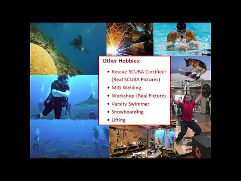

# C# Unity Engine Game Design & Business Concepts

## Quick Personal Pitch (YouTube as of 2018)

## Final Project: Helicopter Resurgence

### CLASSES:
* **1GDD:** Game Design & Development
* **2PGD:** Principles of Game Design
* **3BGE:** Business of Games & Entrepreneurship
* **4GDMP:** Game Development for Modern Platforms
* **5GDDC:** Game Design & Development Capstone

### Description (Coursera Specialization by Michigan State University):
The Game Design & Development Specialization combined Game design with Unity Engine & business of games. Includes a large amount of projects, and the time span of this class is seven months, but I was able to complete it in four. We created various games from “Roller Madness” to my final project “Helicopter Resurgence, ” and learned to create all the documentation on the business side.
